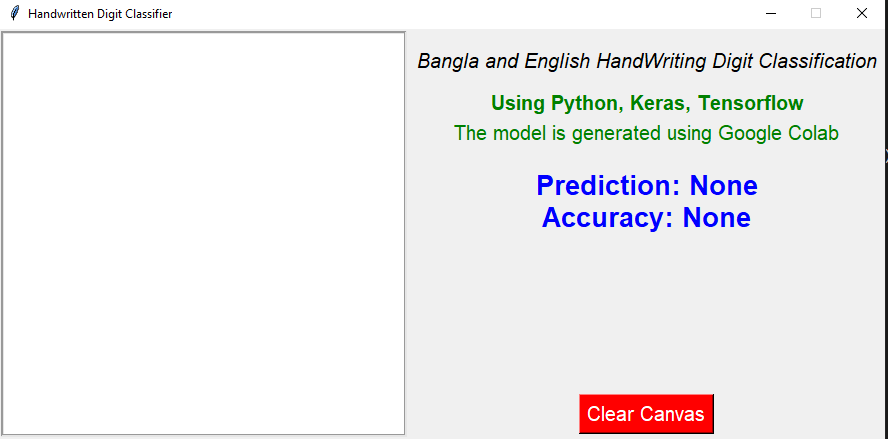

<!-- PROJECT LOGO -->
 

  

  <h1 align="center">Bangla-and-English-Handwritten-Digits-Recognition</h3>

  

    Bangla and English handwritten digits recognition using Convolution Neural Network
     
    <a href="https://github.com/Perdente/Projects/blob/main/4th%20year/AI_courseProject/class_staffs/project%20proposal.pdf"><strong>documentation »</strong></a>
     
  

<!-- TABLE OF CONTENTS -->

  
Table of Contents

  <ol>
    <li>
      <a href="#about-the-project">About The Project</a>
    </li>
    <li>
        <a href="#built-with">Built With</a>
    </li>
    <li>
      <a href="#train-the-model">Train the model</a>
    </li>
    <li>
      <a href="#developing-gui">Developing GUI</a>
    </li>
  </ol>

<!-- ABOUT THE PROJECT -->
# About The Project

The handwritten digit recognition is a famous image classification problem. Convolutional neural networks or widely known as ConvNets are powerful classification models for accomplishing the tasks. As different languages have their particular shapes and styles of their numeric digits, the accuracy rates of different models vary from one another. In this project, I used various CNN structures to train a model with the dataset of both **English** and **Bangla** handwritten digits and also modified slightly to improve the accuracy of the model. The platform I used to train the model is [google colab](https://colab.research.google.com/?utm_source=scs-index) and also develop a _GUI_ in my **PC**
to predict the newly imported digit images.

#### Built With

The list of various libraries and frameworks used to build this model and GUI
| In Colab | In PC | Description |
| --- | --- | --- |
| python $3.7.12$ | python $3.7.9$ | Whole project is based on python language |
| tensorflow $2.7.0$ |tensorflow $2.3.0$ | Python library for fast numerical computing  |
| numpy $1.19.5$ |numpy $1.19.2$ | Used to perform a wide variety of mathematical operations on arrays |
| keras $2.7.0$ |keras $2.4.3$ |  Python library for developing and evaluating deep learning models |
| cv2 $4.1.2$ |cv2 $4.5.1$ |  Open-source library for the computer vision, machine learning, and image processing |
| PIL $7.1.2$ |PIL $8.1.0$ | Adds support for opening, manipulating, and saving many different image file formats |

<!-- GETTING STARTED -->

#### Train the model
1. First import necessary libraries to `Handwritten Digit Recognition.ipynb` file in google colab.
2. Then unzip the `dataset.zip` file and set the path to `Handwritten Digit Recognition.ipynb` file.
3. Now run the `Handwritten Digit Recognition.ipynb` file and train the model.
4. Now model is saved in drive named `English&Bangla_digitModel.h5`.
5. Download the `English&Bangla_digitModel.h5` file and save to PC.

#### Developing GUI
1. Import necessary libraries in `GUI_Handwritten_Digit_Recognition.ipynb` file in PC.
2. Then load the saved model `English&Bangla_digitModel.h5`.
3. Compile the model.
4. Finally run the `GUI_Handwritten_Digit_Recognition.ipynb` file and predict the images drawn in window.

